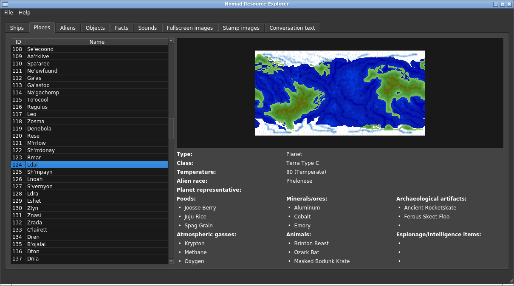

# Nomad Resource Explorer

This is a graphical utility (written using the Qt framework) that allows viewing the images and data files from the 1993 space exploration game "Nomad", developed by
Intense! Interactive and Papyrus Design and published by GameTek.

## Requirements

You'll need the game's data files; specifically, these five .DAT archives:

 - `ANIM.DAT`
 - `CONVERSE.DAT`
 - `INVENT.DAT`
 - `SAMPLES.DAT`
 - `TEST.DAT`

After starting the tool, simply select `Open game data directory` from the *File* menu and point to the directory containing the game data.

## Background

The capability in this tool is a result of my in-depth reverse engineering effort to document functions and data structures within *Nomad*. This is explained further in the [nomad-reverse-engineering repo](https://github.com/colinbourassa/nomad-reverse-engineering).

I've also contributed code to the [Camoto Project](https://github.com/camoto-project), which aims to provide a web-based interface for resource editing of DOS-era games.

## See also

 - https://colinbourassa.github.io/software/nomad

